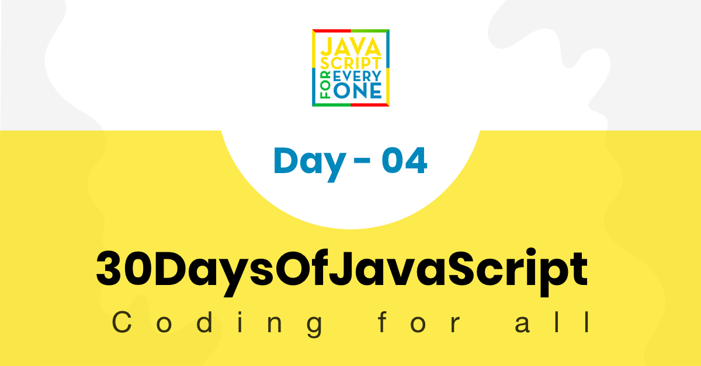

# 30 Days Of JavaScript: Conditionals
[<< Day 03](../Day%2003/readme.md) || [Day 05 >>](../Day%2005/readme.md)


- [📔 Day 04](#📔-day-04-recappinng)
    - [Conditionals](#javascript-conditionals-are-divided-into-3)
        - [if](#the-if-conditional)
        - [ternary](#the-ternary-operator)
        - [switch](#the-switch-conditional)
   
# 📔 Day 04 (recappinng)
## Javascript conditionals are divided into 3:
### The 'if' conditional
```js
let age = Number(prompt('Enter your age:'));

// 1-liner if
if (age >= 18) alert('You are of legal age.');

// block if
if (age >= 18) {
    alert('You are of legal age.');
}

// if-else block
if (age >= 18) {
    alert('You are of legal age.');
} else {
    alert('You are still a minor.');
}

// else-if block
if (age >= 18) {
    alert('You are of legal age.');
} else if(age < 18 && age > 0) {
    alert('You are still a minor.');
} else {
    alert('Invalid number.');
}
```

### The ternary operator
```js
let age = Number(prompt('Enter your age:'));

age >= 18 ? alert('You are of legal age.') : alert('You are still a minor.');
```

### The 'switch' conditional
```js
const num = 0;

switch (num) {
    case 0:
        alert(num)
    break;
    case 1:
        confirm(num)
    break;
    default:
        console.log(num)
    break;
}
```

[<< Day 03](../Day%2003/readme.md) || [Day 05 >>](../Day%2005/readme.md)